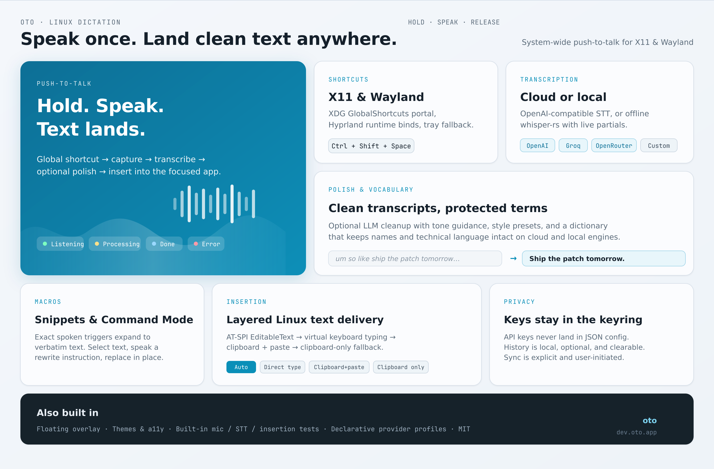
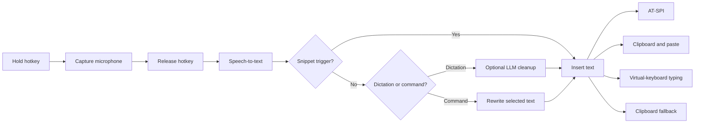

<div align="center">
  
  <h1>Oto</h1>
  <p><strong>System-wide, push-to-talk AI voice dictation for Linux.</strong></p>
  <p>
    Hold a shortcut, speak, then release. Oto transcribes your voice, optionally
    polishes the result, and inserts it into the application you were using.
  </p>
  <p>
    <a href="#features">Features</a> ·
    <a href="#quick-start">Quick start</a> ·
    <a href="#linux-desktop-setup">Linux setup</a> ·
    <a href="#development">Development</a> ·
    <a href="#troubleshooting">Troubleshooting</a>
  </p>
</div>



> [!NOTE]
> Oto is an early Linux desktop release. Desktop integration can vary between
> compositors, portals, accessibility trees, and target applications.

## Features

- Push-to-talk dictation with clear listening, processing, done, and error states.
- Global shortcuts on X11 and Wayland, including XDG GlobalShortcuts and Hyprland support.
- Cloud transcription through OpenAI-compatible APIs or offline transcription with `whisper-rs`.
- Optional transcript cleanup with tone guidance, style presets, and protected vocabulary.
- Exact-trigger voice snippets and select-and-rewrite Command Mode.
- Layered text insertion through AT-SPI, virtual-keyboard typing, clipboard and paste, or clipboard-only fallback.
- Optional, capped local history with copy and delete controls.
- Provider profiles for OpenAI, Groq, OpenRouter, and compatible custom endpoints.
- API keys stored in the operating system keyring, separate from the JSON configuration.
- Configurable themes, text size, reduced motion, overlay behavior, and keyboard focus.
- Explicit, user-controlled JSON sync for dictionary entries, snippets, and styles.
- Built-in checks for the microphone, transcription, provider configuration, and text insertion.

## How it works



Pressing the shortcut starts recording and displays the overlay. Releasing it
stops the recorder, sends the captured audio to the selected transcription
engine, optionally polishes the transcript, and inserts the result into the
previously focused application.

## Quick start

Oto currently targets Linux on X11 or Wayland. After installing the
[development prerequisites](#development-prerequisites), run:

```bash
git clone https://github.com/0veek/oto.git
cd oto
npm install
npm run tauri dev
```

On first launch:

1. Open **Providers**, choose a preset, and save an API key, or add a compatible provider.
2. Under **Models**, choose cloud transcription or a local Whisper model.
3. Keep the default `Ctrl+Shift+Space` shortcut or select an unused chord.
4. Run **Test microphone**, **Test transcription**, and **Test insertion**.
5. Focus a text field, hold the shortcut while speaking, and release it to transcribe.

If the global shortcut cannot be registered, use **Start Listening** and
**Stop Listening** from the system tray.

## Linux desktop setup

Oto uses different desktop services and insertion tools depending on the active
session.

| Environment | Components |
| --- | --- |
| X11 | Tauri global shortcut support; `xdotool` for simulated input |
| Wayland | `xdg-desktop-portal` plus the portal backend for your compositor |
| GNOME Wayland | `xdg-desktop-portal-gnome`; `ydotool` recommended for input |
| Hyprland | `xdg-desktop-portal-hyprland`; Oto creates a runtime `global` binding |
| Secure key storage | A Secret Service implementation such as GNOME Keyring |

Oto first tries direct AT-SPI insertion. If the target application does not
expose an editable accessibility object, it falls back to clipboard and
simulated paste, direct typing, and finally clipboard-only delivery.

### Wayland input

For reliable insertion on Wayland, install `ydotool` and run its user daemon.
`wtype` is an optional fallback.

```bash
# Arch
sudo pacman -S --needed ydotool wtype wl-clipboard xdg-desktop-portal

# Fedora
sudo dnf install ydotool wtype wl-clipboard xdg-desktop-portal

# Debian / Ubuntu
sudo apt install ydotool wtype wl-clipboard xdg-desktop-portal
```

On GNOME, keep `xdg-desktop-portal-gnome` installed. On Hyprland, install and
run `xdg-desktop-portal-hyprland`.

`ydotoold` needs access to `/dev/uinput`, which commonly requires membership in
the `input` group:

```bash
sudo usermod -aG input "$USER"
```

Fully log out of the desktop session and log back in so the new group is
applied. Then enable the user service:

```bash
groups | grep -w input
systemctl --user enable --now ydotool.service
systemctl --user status ydotool.service
```

Verify input by focusing a text field in another application and running:

```bash
ydotool type -- 'hello from ydotool '
```

> [!IMPORTANT]
> Use `systemctl --user`, not the system-level `systemctl` command. If the
> service previously reached its restart limit, run
> `systemctl --user reset-failed ydotool.service` before starting it again.

For portal errors, `/dev/uinput` permission issues, focus problems, and
application-specific insertion failures, see the
[Wayland and GNOME troubleshooting guide](errorfix.md).

## Configuration

### Providers and models

Oto uses OpenAI-compatible endpoints for cloud transcription and optional
transcript polishing.

| Preset | Base URL | Default transcription model | Default polish model |
| --- | --- | --- | --- |
| OpenAI | `https://api.openai.com/v1` | `whisper-1` | `gpt-4o-mini` |
| Groq | `https://api.groq.com/openai/v1` | `whisper-large-v3` | `llama-3.1-8b-instant` |
| OpenRouter | `https://openrouter.ai/api/v1` | `openai/whisper-1` | `openai/gpt-4o-mini` |
| Custom | User supplied | `whisper-1` | `gpt-4o-mini` |

Provider capabilities and model identifiers can change independently of Oto.
Confirm that a custom endpoint implements audio transcriptions and, when polish
is enabled, chat completions.

### Local transcription

Choose **Models → Local Whisper** and provide the absolute path to a
whisper.cpp-compatible `ggml-*.bin` model. See the
[whisper.cpp model guide](https://github.com/ggml-org/whisper.cpp/blob/master/models/README.md)
for model sizes and download options.

Leave the language empty for automatic detection. Use a non-`.en` model for
multilingual speech. Oto caches the selected model after its first load and can
show live partial results while recording.

For a fully local pipeline, disable polishing or point a custom provider at a
localhost OpenAI-compatible LLM. Keyless profiles are allowed only for
`http://localhost` and `http://127.0.0.1`; remote endpoints require a key.

### Snippets, styles, and Command Mode

- A snippet expands only when its trigger is the complete utterance. A trigger
  named `my signature` matches `my signature` or `snippet my signature`, but not
  a longer sentence containing those words.
- Style presets and the free-form tone hint are combined when polishing.
- Command Mode rewrites selected text from a spoken instruction. It reads the
  selection through AT-SPI when possible and otherwise uses simulated copy.

Command Mode always requires a chat-completions model, even when normal
dictation polishing is disabled.

### Hotkeys and text insertion

The default shortcut is `Ctrl+Shift+Space`.

- Wayland uses the XDG GlobalShortcuts portal.
- Hyprland also receives the compositor-side runtime binding required by the portal.
- X11 uses Tauri's native global-shortcut plugin.
- Oto never overwrites an existing Hyprland binding.
- Pressing the shortcut starts listening; releasing it starts processing.

Desktop environments often reserve `Super` shortcuts, and input methods may
reserve chords such as `Ctrl+Alt+Space`. Prefer an unused `Ctrl+Shift+…` chord.

Text insertion has four modes:

| Mode | Behavior |
| --- | --- |
| **Auto** | Try AT-SPI, clipboard and simulated paste, direct typing, then clipboard-only |
| **Direct type** | Type through `ydotool`, `wtype`, or `xdotool` |
| **Clipboard + paste** | Copy the transcript and invoke a supported paste simulator |
| **Clipboard only** | Copy the transcript without generating keyboard input |

On Hyprland, Oto attempts to restore the target captured when recording began.
On GNOME Wayland, keep the target field focused through the processing stage.

### Storage and optional sync

Non-secret settings are normally stored at:

```text
~/.config/oto/config.json
```

API keys are stored separately through Secret Service under `dev.oto.app`, with
one account per provider preset. Oto rejects attempts to serialize keys into the
configuration file.

History is normally stored at:

```text
~/.local/share/oto/history.json
```

Sync is disabled by default and runs only when **Sync now** is pressed. The
configured HTTPS endpoint must support `GET` and `PUT` for one JSON document;
plain HTTP is accepted only for localhost. Sync includes dictionary entries,
snippets, and styles—not provider credentials, audio, history, or general
settings. An optional bearer token is stored in the OS keyring.

## Development

### Development prerequisites

| Requirement | Purpose |
| --- | --- |
| Node.js 18+ and npm | SvelteKit frontend and Tauri CLI |
| Stable Rust toolchain, Clang, and CMake | Tauri backend and local Whisper bindings |
| [Tauri 2 Linux prerequisites](https://v2.tauri.app/start/prerequisites/) | Desktop build libraries |
| `webkit2gtk-4.1` | WebView runtime |
| ALSA development libraries | Microphone capture through `cpal` |
| libsecret development libraries | Secure API-key storage |
| libayatana-appindicator development libraries | System tray and Linux package generation |
| A working microphone | Dictation input |

Package names vary by distribution. A typical Arch or CachyOS setup is:

```bash
sudo pacman -S --needed base-devel webkit2gtk-4.1 \
  libayatana-appindicator alsa-lib libsecret nodejs npm rust clang cmake \
  patchelf wtype ydotool wl-clipboard
```

AppIndicator is required for production packaging because Oto includes a system
tray:

| Distribution | Package |
| --- | --- |
| Arch / CachyOS | `libayatana-appindicator` |
| Debian / Ubuntu | `libayatana-appindicator3-dev` |
| Fedora | `libayatana-appindicator-gtk3-devel` |

Confirm that `pkg-config` can find it:

```bash
pkg-config --exists ayatana-appindicator3-0.1 && echo "appindicator ok"
```

### Common commands

```bash
# Install JavaScript dependencies
npm install

# Run the desktop app with frontend hot reload
npm run tauri dev

# Check the Svelte frontend
npm run check

# Build the frontend
npm run build

# Run Rust tests and compile checks
cd src-tauri
cargo test
cargo check
```

The Tauri development process opens the settings window and keeps the overlay
preloaded but hidden until dictation starts.

### Production builds

Build all configured Linux package formats with:

```bash
npm run tauri build
```

Artifacts are written below `src-tauri/target/release/bundle/`:

```text
appimage/Oto_<version>_amd64.AppImage
deb/Oto_<version>_amd64.deb
rpm/Oto-<version>-1.x86_64.rpm
```

The `npm run tauri build` wrapper checks for AppIndicator and sets `NO_STRIP=1`
to avoid older `linuxdeploy` strip binaries failing on modern ELF sections. The
first AppImage build may require network access to download its runtime.

The [Flatpak packaging guide](packaging/README.md) explains how to wrap the
Tauri Debian artifact and documents the sandbox limitations. GitHub Actions
runs frontend checks, production compilation, Rust tests, and `cargo check`;
tags matching `v*` create draft releases with AppImage, Debian, and RPM
artifacts.

## Architecture

Oto is a Tauri 2 desktop application. Svelte owns the overlay and settings
webviews, while Rust owns audio capture, credentials, global shortcuts,
providers, text insertion, and pipeline state.

```text
.
├── src/                              SvelteKit frontend
│   ├── lib/components/FloatingPill   Overlay state and controls
│   ├── lib/components/settings/      Settings sections
│   ├── lib/stores/pipeline.ts        Typed frontend pipeline state
│   └── routes/                       Overlay and settings routes
├── src-tauri/                        Rust/Tauri backend
│   ├── src/audio/                    Microphone capture and WAV encoding
│   ├── src/commands/                 Frontend command handlers
│   ├── src/config/                   Config file and keyring boundary
│   ├── src/features/                 Snippets, history, and opt-in sync
│   ├── src/hotkeys/                  X11 and Wayland shortcut registration
│   ├── src/injection/                AT-SPI, clipboard, and paste tools
│   ├── src/pipeline/                 Lifecycle, events, and cancellation
│   └── src/providers/                Provider traits and compatible client
├── packaging/                        Flatpak manifest and AppStream metadata
├── .github/workflows/                Continuous verification and tagged releases
├── package.json                      Frontend and Tauri scripts
└── src-tauri/tauri.conf.json         Window, security, and bundle configuration
```

The backend emits typed `pipeline://event` messages. Hotkey and tray controls
call the same orchestrator, so recording, cancellation, overlay visibility,
error handling, and insertion share one lifecycle.

## Privacy and security

- Cloud transcription sends recorded audio only to the configured speech-to-text provider.
- Local Whisper keeps transcription on the device.
- Polishing sends transcript text to the configured chat-completions provider.
- API keys remain in the operating system keyring.
- History remains on the device and can be disabled or cleared independently.
- Sync is disabled by default and communicates only with the endpoint you configure.
- Oto does not operate an intermediary cloud service.

Review the policies of the provider you select. Use local transcription and a
trusted local endpoint if you need an entirely on-device data boundary.

## Troubleshooting

### The hotkey or overlay does not appear

1. Check whether another desktop shortcut owns the configured chord.
2. Restore `Ctrl+Shift+Space`, save, and restart Oto.
3. On Wayland, verify that the portal and compositor-specific backend are running.
4. Try the tray controls. If they work, the problem is shortcut registration.
5. Use **Appearance → Preview listening** to test the overlay independently.

### Text is transcribed but not inserted

The transcript is already on the clipboard when the insertion chain reaches its
final fallback. Check the injection log:

```bash
tail -n 50 "/tmp/oto-inject-${USER}.log"
```

On Wayland, verify that `ydotoold` is active and can type into another
application. On X11, install `xdotool`. Start with **Auto**, then test
**Clipboard + paste**, **Direct type**, or **Clipboard only** for applications
that block synthetic input.

### API key or keyring errors

- Make sure a Secret Service implementation is running and unlocked.
- Save the key again under the currently selected provider.
- The JSON configuration intentionally contains no API keys.

### Packaging fails after compilation

If Tauri reports `Can't detect any appindicator library`, install the
distribution package listed under
[Development prerequisites](#development-prerequisites), verify it with
`pkg-config`, and rerun `npm run tauri build`.

If `linuxdeploy` fails, use the npm wrapper rather than calling `tauri build`
directly; the wrapper supplies the required `NO_STRIP=1` workaround.

For a complete Wayland and GNOME diagnostic catalog, see
[`errorfix.md`](errorfix.md).

## Contributing

1. Create a branch from the current default branch.
2. Keep platform-specific behavior behind clear Linux session checks.
3. Run `npm run check`, `npm run build`, `cargo test`, and `cargo check`.
4. In pull requests, describe the tested session: X11 or Wayland, compositor,
   portal backend, and insertion tool.

Implementation rationale is available in the
[design specification](docs/superpowers/specs/2026-07-19-oto-design.md) and
[MVP implementation plan](docs/superpowers/plans/2026-07-19-oto-mvp.md).

## License

Licensed under the [Apache License, Version 2.0](LICENSE).
