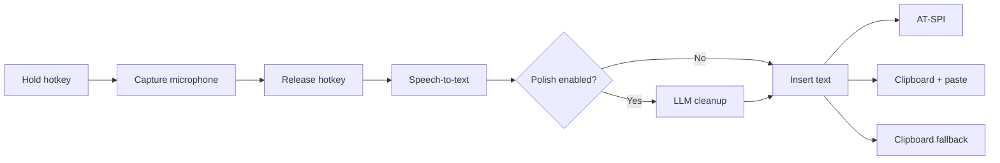

<div align="center">
  
  <h1>Oto</h1>
  <p><strong>System-wide, push-to-talk AI voice dictation for Linux.</strong></p>
  <p>Hold a shortcut, speak, release, and Oto transcribes, optionally polishes, and inserts the result into the application you were using.</p>
</div>

> [!NOTE]
> Oto is an early Linux desktop MVP. The core dictation flow is implemented, but desktop integration can vary between compositors, portals, and target applications.

## Features

- Hold-to-talk dictation with distinct **Listening**, **Processing**, **Done**, and **Error** overlay states.
- Global shortcuts on X11 and Wayland, including XDG GlobalShortcuts portal support and Hyprland runtime bindings.
- OpenAI-compatible speech-to-text and chat-completions APIs.
- Presets for OpenAI, Groq, OpenRouter, and custom compatible endpoints.
- Optional transcript cleanup with tone guidance and a protected-terms dictionary.
- Layered Linux text insertion: AT-SPI, clipboard plus simulated paste, then clipboard-only fallback.
- System tray controls when the global shortcut is unavailable.
- API keys stored in the operating system keyring—not in the JSON configuration file.
- Draggable, always-on-top overlay with hidden and minimal idle modes.
- Built-in checks for the microphone, transcription, provider configuration, and text insertion.

## How it works



The overlay becomes visible as soon as the press event starts a recording. Releasing the shortcut switches it to processing, stops the recorder, sends the WAV data to the configured provider, optionally polishes the transcript, and injects the result into the previously focused application.

## Requirements

Oto currently targets Linux on X11 or Wayland.

| Requirement | Why it is needed |
| --- | --- |
| Node.js 18+ and npm | SvelteKit frontend and Tauri CLI |
| Stable Rust toolchain | Native Tauri backend |
| Tauri 2 Linux prerequisites | WebKitGTK and desktop build libraries |
| ALSA development libraries | Microphone capture through `cpal` |
| Secret Service / libsecret | Secure API-key storage |
| A working microphone | Dictation input |

Install the packages listed in the official [Tauri Linux prerequisites](https://v2.tauri.app/start/prerequisites/) for your distribution. You may also need the distribution packages for ALSA and libsecret development headers.

### Desktop integration

Install the tools relevant to your session:

| Environment | Required or recommended components |
| --- | --- |
| Wayland | `xdg-desktop-portal` plus the portal backend for your compositor |
| Hyprland | `xdg-desktop-portal-hyprland`; Oto creates a runtime `global` bind |
| Wayland paste | `wtype` preferred; `ydotool` is a fallback |
| X11 paste | `xdotool` |

Oto can still leave the result on the clipboard when no supported paste tool is available.

## Quick start

```bash
git clone https://github.com/0veek/oto.git
cd oto
npm install
npm run tauri dev
```

On first launch:

1. Open **Providers**, choose a preset, and save the API key.
2. Confirm the speech-to-text model under **Models**.
3. Keep the default `Ctrl+Shift+Space` shortcut or choose an unused chord.
4. Use **Test microphone**, **Test transcription**, and **Test insertion** before your first full dictation.
5. Hold the shortcut while speaking and release it to process the recording.

The tray menu provides **Start Listening** and **Stop Listening** if a global shortcut cannot be registered.

## Provider configuration

Oto uses an OpenAI-compatible client for both audio transcription and optional transcript polishing.

| Preset | Base URL | Default STT model | Default polish model |
| --- | --- | --- | --- |
| OpenAI | `https://api.openai.com/v1` | `whisper-1` | `gpt-4o-mini` |
| Groq | `https://api.groq.com/openai/v1` | `whisper-large-v3` | `llama-3.1-8b-instant` |
| OpenRouter | `https://openrouter.ai/api/v1` | `openai/whisper-1` | `openai/gpt-4o-mini` |
| Custom | User supplied | `whisper-1` | `gpt-4o-mini` |

Provider capabilities and model identifiers change independently of Oto. Confirm that your endpoint implements the compatible audio-transcription route and, when polishing is enabled, chat completions.

### Settings

- **Providers**: preset, base URL, and keyring-backed API key.
- **Models**: STT model, polish model, temperature, language, and tone hint.
- **Hotkeys**: the push-to-talk chord.
- **Dictionary**: names and technical terms the polisher should preserve.
- **Appearance**: hidden or minimal idle overlay, UI preview, and microphone test.
- **Injection**: automatic, clipboard-and-paste, or clipboard-only delivery.
- **About**: version and privacy summary.

Configuration is stored at the platform XDG location, normally:

```text
~/.config/oto/config.json
```

API keys are stored separately by the Secret Service keyring under service `dev.oto.app`, with one account per provider preset. Oto rejects attempts to serialize API-key fields into its configuration JSON.

## Hotkeys

The default shortcut is `Ctrl+Shift+Space`.

- On **Wayland**, Oto registers through the XDG GlobalShortcuts portal.
- On **Hyprland**, Oto also installs the compositor-side runtime `global` binding required to activate the portal shortcut.
- On **X11**, Oto uses Tauri's native global-shortcut plugin.
- Repeated press events are filtered, so holding the key does not immediately stop recording.
- A press begins listening; the corresponding release stops capture and starts processing.
- Oto will not overwrite an existing Hyprland binding. If a saved chord becomes unavailable, startup falls back to `Ctrl+Shift+Space` when that chord is free.

Prefer combinations such as `Ctrl+Shift+Space` or `Ctrl+Shift+D`. Desktop environments commonly reserve `Super` shortcuts, while input methods may reserve combinations such as `Ctrl+Alt+Space`.

## Text insertion

The three modes are:

| Mode | Behavior |
| --- | --- |
| **Auto** | Try AT-SPI, then copy and simulate `Ctrl+V`, then keep text on the clipboard |
| **Clipboard + paste** | Copy and require a supported paste simulator |
| **Clipboard only** | Copy without generating keyboard input |

On Wayland, simulated paste uses `wtype` or `ydotool`. On X11 it uses `xdotool`. Some sandboxed, privileged, terminal, or custom-rendered applications may reject accessibility insertion; use the insertion test to verify your target application.

## Development

```bash
# Install JavaScript dependencies
npm install

# Run the desktop app with frontend hot reload
npm run tauri dev

# Frontend type and accessibility checks
npm run check

# Frontend production build
npm run build

# Rust tests
cd src-tauri
cargo test

# Rust compile check
cargo check
```

The Tauri development process opens the settings window and keeps the overlay preloaded but hidden until dictation starts.

## Production builds

Build all configured Linux package formats with:

```bash
npm run tauri build
```

Artifacts are written below `src-tauri/target/release/bundle/`:

```text
appimage/Oto_<version>_amd64.AppImage
deb/Oto_<version>_amd64.deb
rpm/Oto-<version>-1.x86_64.rpm
```

The npm Tauri script sets `NO_STRIP=1`. This avoids the older `strip` executable embedded in `linuxdeploy` failing on modern Linux ELF sections such as `.relr.dyn`. The first AppImage build may need network access to download the AppImage runtime.

## Architecture

Oto is one Tauri 2 desktop application: Svelte owns the two webview interfaces, while Rust owns audio, credentials, global shortcuts, providers, injection, and pipeline state.

```text
.
├── src/                              SvelteKit frontend
│   ├── lib/components/FloatingPill   Overlay state and controls
│   ├── lib/components/settings/      Settings sections
│   ├── lib/stores/pipeline.ts        Typed frontend pipeline state
│   └── routes/                       Overlay and settings routes
├── src-tauri/                        Rust/Tauri backend
│   ├── src/audio/                    Microphone capture and WAV encoding
│   ├── src/commands/                 Frontend command handlers
│   ├── src/config/                   Config file and keyring boundary
│   ├── src/hotkeys/                  X11 and Wayland PTT registration
│   ├── src/injection/                AT-SPI, clipboard, and paste tools
│   ├── src/pipeline/                 Lifecycle, events, cancellation
│   └── src/providers/                Provider traits and compatible client
├── static/                           Frontend static assets
├── docs/superpowers/                 Design specification and implementation plan
├── package.json                      Frontend and Tauri scripts
└── src-tauri/tauri.conf.json         Windows, security, and bundle configuration
```

The backend emits typed `pipeline://event` messages. Both hotkey and tray controls call the same orchestrator, keeping recording, cancellation, error handling, overlay visibility, and insertion behavior consistent.

## Privacy and security

- Recorded audio is sent to the configured speech-to-text provider.
- When polishing is enabled, transcript text is sent to the configured chat-completions provider.
- API keys remain in the operating system keyring.
- Non-secret preferences are stored in the local XDG configuration file.
- Oto does not operate an intermediary cloud service.

Review the policies of the provider you select. Use a trusted custom endpoint if you need a different data-handling boundary.

## Troubleshooting

### The hotkey or overlay does not appear

1. Check whether another desktop shortcut already owns the configured chord.
2. Return to `Ctrl+Shift+Space`, save, and restart Oto.
3. On Hyprland, confirm `xdg-desktop-portal-hyprland` is running.
4. Test the pipeline with tray **Start Listening** / **Stop Listening**. If the tray path works, the problem is shortcut registration rather than the overlay or microphone.
5. Use **Appearance → Preview listening** to test the overlay independently.

### Text is copied but not inserted

- Install `wtype` on Wayland or `xdotool` on X11.
- Select **Clipboard + paste** and run **Test insertion** with another editable application focused.
- Some applications block synthetic input; use clipboard-only mode there.
- `ydotool` also requires its daemon and the relevant input-device permissions.

### API-key or keyring errors

- Make sure a Secret Service implementation is running and unlocked.
- Save the key again under the currently selected provider preset.
- The JSON config intentionally contains no API key.

### `failed to run linuxdeploy`

Use `npm run tauri build`, not a direct `tauri build`; the npm script supplies the required `NO_STRIP=1` workaround. Make sure the first AppImage build can access the network.

## Contributing

1. Create a branch from the current default branch.
2. Keep platform-specific behavior behind clear Linux session checks.
3. Run `npm run check`, `npm run build`, `cargo test`, and `cargo check` before opening a pull request.
4. Describe the desktop session used for manual tests—X11 or Wayland, compositor, portal backend, and insertion tool.

The implementation rationale is documented in the [design specification](docs/superpowers/specs/2026-07-19-oto-design.md) and [MVP implementation plan](docs/superpowers/plans/2026-07-19-oto-mvp.md).

## License

MIT
